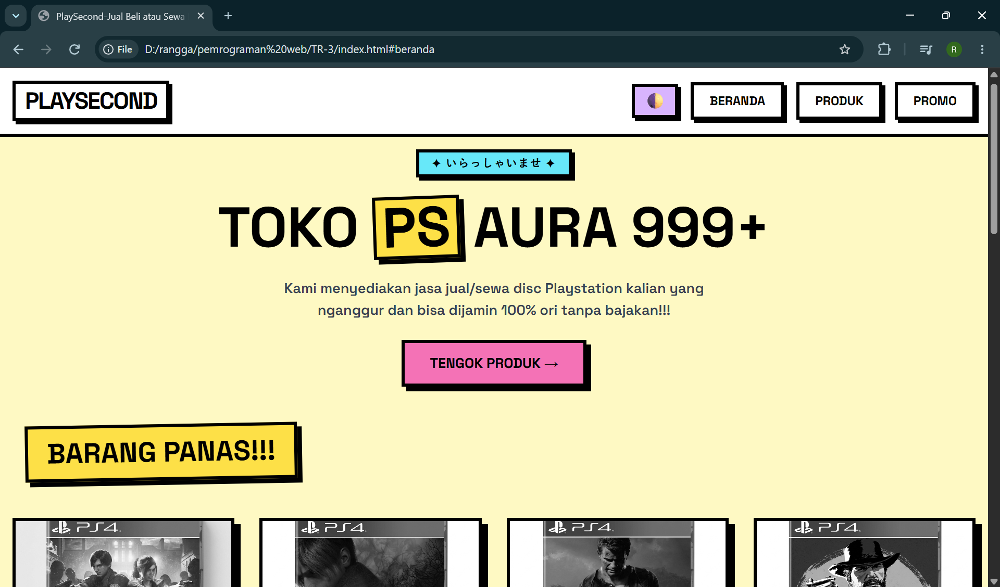

# 🛍️ Tugas Rutin 3 — Katalog Produk Responsif

Repositori ini berisi implementasi **Tugas Rutin 3: Katalog Produk Responsif** pada mata kuliah **Pemrograman Web** (Pertemuan 3). Proyek ini mengangkat topik _Case Method: Katalog Produk Responsif_ yang dibangun menggunakan framework **Tailwind CSS** dengan pendekatan desain **mobile-first**, tata letak kisi (_grid_) adaptif, tipografi dinamis berbasis fungsi CSS `clamp()`, serta navigasi responsif dengan menu hamburger.

---

## 🔗 Live Demo & Pengujian

- **Demo Halaman (GitHub Pages):**
  https://rnglich.github.io/TugasWeb-Pertemuan3-Katalog/
- **Repository GitHub:**
  https://github.com/rnglich/TugasWeb-Pertemuan3-Katalog

---

## 🛠️ Pemenuhan Requirements Tugas

Proyek ini telah memenuhi seluruh 9 poin persyaratan utama yang diberikan:

### 1. Pendekatan Mobile-First (`Mobile-first approach`)

- Gaya dasar (_base style_) ditulis tanpa prefix breakpoint untuk menargetkan perangkat seluler terlebih dahulu .
- Pengayaan tata letak layar lebar diterapkan secara progresif menggunakan utilitas breakpoint Tailwind (`sm:`, `md:`, `lg:`, `xl:`)[: 3].

### 2. Minimal 3 Breakpoint Responsif

Halaman dioptimalkan secara presisi pada tiga ambang batas resolusi perangkat :

- **Mobile View:** `425 px` (ponsel).
- **Tablet View:** `md:` (≥ 768px) (perangkat tablet dan ponsel lipat) .
- **Desktop View:** `lg:` (≥ 1024px) / `xl:` (≥ 1280px) (layar laptop dan monitor PC) .

### 3. Grid Responsif (1 → 2 → 3/4 Kolom)

Tata letak katalog menggunakan sistem CSS Grid adaptif dengan utility class Tailwind :

- **Mobile:** 1 kolom (`grid-cols-1`) .
- **Tablet:** 2 kolom (`sm:grid-cols-2`) .
- **Desktop:** 3 hingga 4 kolom (`lg:grid-cols-3 xl:grid-cols-4`) .
- Dilengkapi jarak antar kartu yang konsisten menggunakan `gap-6` atau `gap-8`.

### 4. Komponen Kartu Produk Lengkap (`Card Produk`)

Setiap kartu barang dirancang dengan struktur elemen modular :

- **Gambar Produk:** Menggunakan rasio aspek seragam (`aspect-square` / `aspect-[4/3]`) dengan transisi zoom saat hover (`hover:scale-105 transition-transform`) .
- **Informasi Produk:** Label/kategori (_badge_), judul nama barang (`<h3>`), ulasan (_rating stars_), serta ringkasan deskripsi .
- **Harga:** Penataan harga normal, harga promo, dan diskon yang kontras .
- **Tombol Aksi (Button):** Tombol _Call-to-Action_ (CTA) "Beli Sekarang" / "Tambah ke Keranjang" yang interaktif dengan efek transisi warna dan status fokus .

### 5. Navbar Responsif dengan Hamburger Menu

- **Layar Desktop (`md:` ke atas):** Menampilkan daftar menu navigasi secara horizontal (`hidden md:flex space-x-6 items-center`) .
- **Layar Mobile:** Mengintegrasikan tombol hamburger icon (`md:hidden`) yang dapat membuka menu dropdown (_collapsible menu_) melalui script toggle ringan .

### 6. Gambar Responsif (`Responsive Images`)

- Menggunakan class `w-full h-auto object-cover` untuk memastikan gambar tidak melebihi lebar wadah induk dan tidak mengalami distorsi proporsi .
- Dilengkapi atribut `loading="lazy"` serta teks alternatif `alt` yang deskriptif guna mendukung kecepatan muat dan aksesibilitas web.

### 7. Komponen Footer

- Bagian kaki halaman (`<footer>`) semantik yang responsif (tersusun 1 kolom di layar ponsel dan menyebar ke multi-kolom di layar desktop) .
- Memuat profil singkat toko/brand, navigasi cepat, tautan sosial media, metode pembayaran, dan label hak cipta (_copyright_) .

### 8. Dokumentasi Pengujian (Screenshot 3 Breakpoint)

Pengujian visual dilakukan menggunakan _DevTools Device Mode_ dan didokumentasikan ke dalam repositori pada 3 representasi layar :

- Tampilan Mobile (375px / 414px)
- Tampilan Tablet (768px)
- Tampilan Desktop (1280px / 1440px)

---

## 📋 Checklist Persyaratan Tugas

| No  | Kriteria Persyaratan                          | Implementasi Tailwind CSS                                        |    Status    |
| :-: | :-------------------------------------------- | :--------------------------------------------------------------- | :----------: |
|  1  | _Mobile-first approach_                       | Styling dasar mobile, scaling via prefix `sm:`, `md:`, `lg:`     | ✅ Terpenuhi |
|  2  | Minimal 3 breakpoint                          | Mobile (<640px), Tablet (`md:` 768px), Desktop (`lg:` 1024px+)   | ✅ Terpenuhi |
|  3  | Grid responsif (1 → 2 → 3/4 kolom)            | `grid grid-cols-1 sm:grid-cols-2 lg:grid-cols-3 xl:grid-cols-4`  | ✅ Terpenuhi |
|  4  | Card produk (gambar + info + harga + btn)     | Komponen kartu lengkap dengan foto, teks, harga, dan tombol aksi | ✅ Terpenuhi |
|  5  | Navbar responsif (hamburger di mobile)        | Menu desktop horizontal & hamburger drawer toggle pada mobile    | ✅ Terpenuhi |
|  6  | _Responsive images_                           | `w-full h-auto object-cover` & rasio aspek konsisten             | ✅ Terpenuhi |
|  7  | `clamp()` untuk typography                    | `text-[clamp(...)]` pada heading dan teks hero                   | ✅ Terpenuhi |
|  8  | Footer                                        | Footer semantik responsif multi-kolom                            | ✅ Terpenuhi |
|  9  | Dokumentasi testing (screenshot 3 breakpoint) | Bukti uji tangkapan layar tersimpan pada folder `screenshots/`   | ✅ Terpenuhi |

---

## 📸 Dokumentasi Pengujian Breakpoint

Berikut adalah hasil pengujian tampilan responsif pada tiga ukuran perangkat yang berbeda :

| Ukuran Layar | Resolusi Pengujian            | Pratinjau Tampilan                      |
| :----------- | :---------------------------- | :-------------------------------------- |
| **Mobile**   | 375 × 667 px (iPhone SE)      | ![Mobile View] (assets/MobileView.png)  |
| **Tablet**   | 768 × 1024 px (iPad Mini)     | ![Tablet View] (assets/TabView.png)     |
| **Desktop**  | 1366 × 768 px / 1440 × 900 px |  |

---
